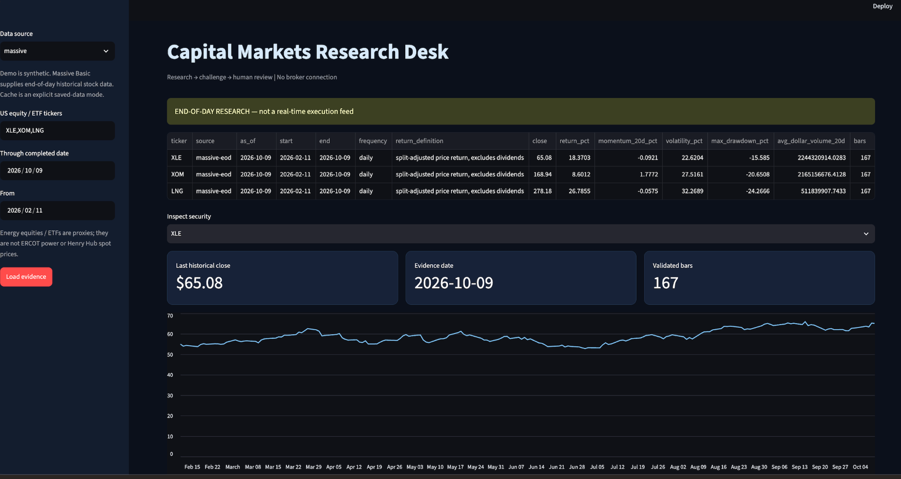
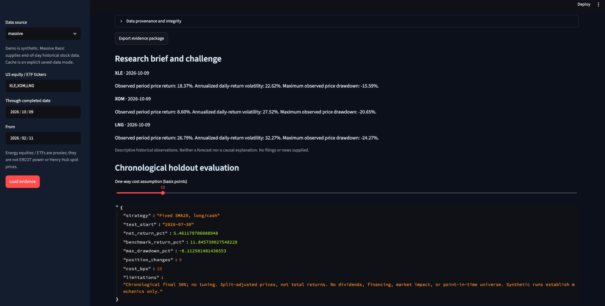
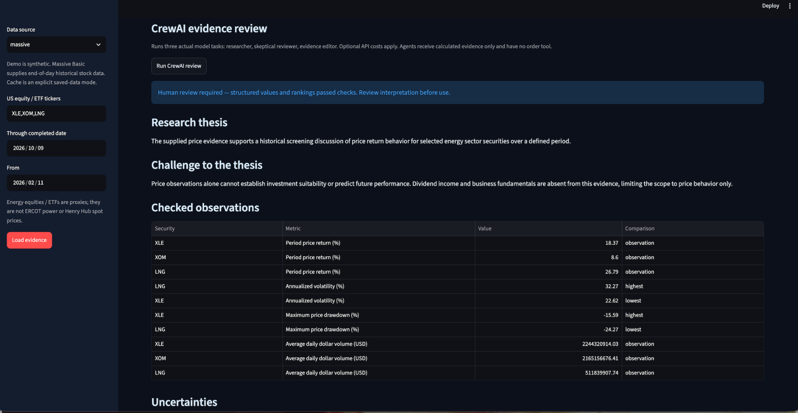

# Capital Markets Research Desk

A research workbench that combines traceable historical market evidence, a fixed-rule strategy evaluation, and a skeptical CrewAI brief for human review.

**Historical evidence · Bounded AI research · Human authority**

## The decision this supports

Does a research idea survive a transparent historical comparison—and what evidence is still missing?

The desk keeps measured observations, strategy evaluation, and model interpretation visible as separate parts of the discussion. Python calculates the financial metrics; CrewAI drafts a thesis, challenges it, and names uncertainties. A human decides how much weight to give the result.

The business purpose is to expose assumptions and weak evidence before a research narrative becomes a trading decision.

## What the application does

- Compares historical daily price evidence across selected equity/ETF symbols.
- Displays deterministic research observations with source and date context.
- Evaluates a fixed SMA20 long/cash rule on a chronological holdout.
- Shows net return, benchmark return, drawdown, position changes, and assumed costs.
- Produces an optional checked CrewAI brief and exports the source evidence.

## Evaluation method

The rule is fixed; the application does not optimize its parameters. The final **30%** of observations form the chronological holdout. Signals use a prior close and prior moving-average evidence, execution uses the next open, and returns use open-to-open prices. One-way costs are configurable, with closing costs included.

This makes timing and cost assumptions inspectable. It does not eliminate selection bias or establish profitability. Dividends, financing, market impact, and point-in-time universe selection are absent.

## Demonstration evidence

A local Massive run on **October 10, 2026** loaded **167 daily bars each for XLE, XOM, and LNG**, covering **February 11–October 9**. The displayed **XLE** holdout began **July 30**. With **10 basis points** of one-way costs, the strategy returned **5.46%**, versus **11.85%** for its benchmark, with a **−8.11%** strategy drawdown and **9 position changes**.

**The strategy underperformed its benchmark in this sample.** The application displays that result alongside its assumptions. A subsequent CrewAI research review reached `HUMAN_REVIEW_REQUIRED`. These are local demonstration observations, not an investment recommendation or validated trading edge.

## Application screenshots

Local demonstrations captured on October 10, 2026. These show historical research and simulation; they do not establish investment suitability, profitable trading, or production readiness.



Historical daily evidence for XLE, XOM, and LNG, with explicit Massive provenance and price returns excluding dividends.

<details>
<summary>View the workflow and CrewAI review</summary>



Fixed SMA20 chronological holdout for XLE: 5.46% strategy return versus 11.85% benchmark return at 10 bps one-way costs. The strategy underperformed in this sample.



CrewAI research, counterargument, and checked metric claims. Passing structured checks does not validate every narrative sentence.

</details>

## Architecture and evidence boundary

| Layer | Responsibility | Evidence to inspect |
|---|---|---|
| Streamlit | User-selected symbols, dates, and workflow controls | [Application](app.py) |
| Market data | Provider response validation, explicit cache, and Python analytics | [Market module](src/desk/market.py) |
| CrewAI | Bounded research and skeptical interpretation | [Crew and validator](src/desk/crew.py) |
| Review surface | Accepted structured observations or a withheld draft with issues | [Review UI](src/desk/review_ui.py) |
| Verification | Offline numerical, boundary, and dashboard checks | [Tests](tests/) |

**Capability is not authority.** Model output never grants permission to trade. There is no broker connection, exchange integration, or real-money execution path.

## CrewAI: execution, checks, and correction

The optional review constructs three actual agents and tasks, then calls `Crew.kickoff()` in sequence: **market researcher → skeptical risk reviewer → evidence editor**. Agents receive calculated evidence, have no external tools, and cannot delegate or submit orders.

The final Pydantic output contains a thesis, counterargument, evidence citations, uncertainties, and structured metric claims. Agents cite short references such as `E1`. Python resolves only exact registered references to the full evidence hashes; it does not guess or repair mistyped citations. The audit retains the reference map, raw model output, and resolved review. Python checks citation membership, numeric values, and highest/lowest rankings against the loaded evidence. Drawdown is signed: the most negative value is the deepest loss. Rankings are only relative to the selected universe; they have little meaning for a single security.

| Review status | Meaning |
|---|---|
| `CORRECTION_REQUIRED` | Draft failed checks; the readable accepted brief is withheld |
| `HUMAN_REVIEW_REQUIRED` | Structured checks passed; interpretation still needs human judgment |
| Call/schema failure | No new review is accepted |

A failed draft gets at most one additional correction kickoff with an independent editor and field-specific feedback. Both attempts remain in the displayed audit. CrewAI may make multiple model requests within each kickoff; the correction therefore adds API usage. The audit reports usage per attempt.

Narrative wording checks reject numeric/comparative prose and unsupported total-return wording, with narrowly approved missing-data disclosures. **These are limited rules, not a semantic proof.** Qualitative claims such as “elevated volatility” can still lack a reference baseline. A valid schema, matching digest, or passed metric check does not establish that every sentence is accurate or useful. Human review remains required.

## Data modes and financial meaning

| Mode | Source | What it establishes |
|---|---|---|
| `demo` | Generated synthetic daily bars | Workflow mechanics without credentials |
| `massive` | Massive split-adjusted historical daily OHLCV | Provider-backed end-of-day evidence |
| `cache` | Saved response for the exact ticker/date range | Explicit reuse of previously loaded evidence |

The application uses an end-of-day research feed. It checks finite prices, OHLC consistency, timestamp order, date bounds, and sufficient history. Each exported dataset includes provenance, an as-of date, a provider request ID when available, and a SHA-256 digest. A digest helps identify/check the supplied rows; it does not authenticate the provider or prove their economic correctness.

Price returns exclude dividends. Momentum uses twenty trading sessions; annualized volatility uses sample daily-return standard deviation and a trading-year convention. Dollar volume is a historical close-times-volume estimate. XLE, XOM, and LNG are equity/ETF energy proxies—not ERCOT power prices, Henry Hub spot prices, or direct Texas-market evidence. No filings, news, valuation, or fundamental data are supplied to the crew.

Requests are paced at 12.5 seconds per session for the configured Basic-tier assumptions. Other running applications share the account’s provider limits. Errors are displayed; the app does not silently substitute demo data for a failed provider request. Consult provider terms before redistributing downloaded data.

## Run locally in PyCharm or a terminal

Use a project virtual environment; avoid installing into Homebrew’s system Python. Python 3.11–3.13 is the project setup range. From the repository folder on macOS/Linux:

```bash
python3 -m venv .venv
source .venv/bin/activate
python -m pip install -e ".[dev,ai]"
python -m pytest -q
python -m streamlit run app.py --server.port 8502
```

Open **http://localhost:8502**. In PyCharm, select this project’s `.venv` interpreter. The `ai` extra installs CrewAI; use `.[dev]` if you only need deterministic research and the dashboard.

Copy [.env.example](.env.example) to a local `.env` and enter your credentials there:

```dotenv
MASSIVE_API_KEY=your_local_massive_key
OPENAI_API_KEY=your_local_openai_key
CREWAI_MODEL=openai/gpt-4.1-mini
```

Massive needs its key for provider data; OpenAI is only needed for the optional model review. The app loads the project-root `.env` automatically at startup, with file values taking precedence over shell values. Restart after changing credentials. Keep `.env` local; never commit or include keys in screenshots.

Select one to five tickers and a range with at least sixty trading sessions. Load evidence, inspect the source and dates, then optionally run CrewAI once. Switching/reloading evidence clears the prior AI brief. Model access and API charges depend on the configured provider account.

## Verification and scope

**Latest local verification: 45 tests passed on October 10, 2026.** Tests cover market validation and analytics, structured claim checks, exact reference resolution, preserved raw audit output, bounded correction, dashboard rendering, and retained fixture behavior. AI orchestration tests construct CrewAI objects with model calls mocked; they do not contact providers. The demonstration observations above come from separate locally credentialed runs inspected through the application screenshots.

The interactive application is [app.py](app.py). The older [static dashboard](docs/index.html) is a fixture view, and [legacy fixture scope](docs/legacy-fixture-scope.md) preserves its original implementation and limitations. This project is portfolio evidence of a local research/simulation system; it is not customer production or proof of profitable execution.

## Related projects

| Project | Distinct purpose |
|---|---|
| [Investment Gems](https://github.com/TAM-DS/investment-gems) | Transparent shortlist screening |
| [Capital Markets Research Desk](https://github.com/TAM-DS/capital-markets-research-desk) | Research challenge and historical strategy evaluation |
| [Paper Trading Floor](https://github.com/TAM-DS/paper-trading-floor) | Explicit local confirmation and persistent simulated fills |

[Massive aggregate API](https://massive.com/docs/rest/stocks/aggregates/custom-bars) · [CrewAI documentation](https://docs.crewai.com/)
